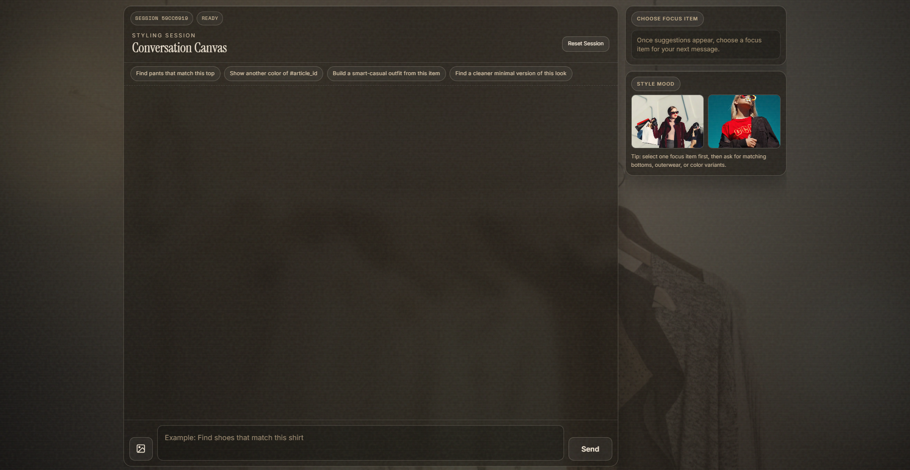
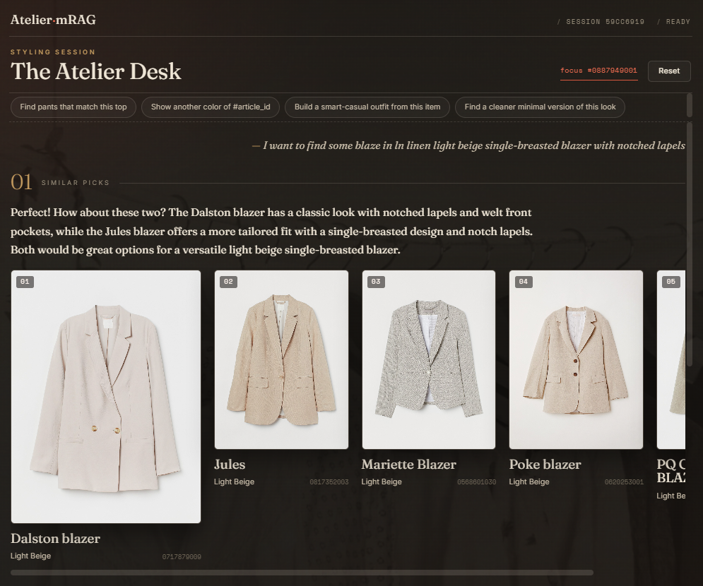
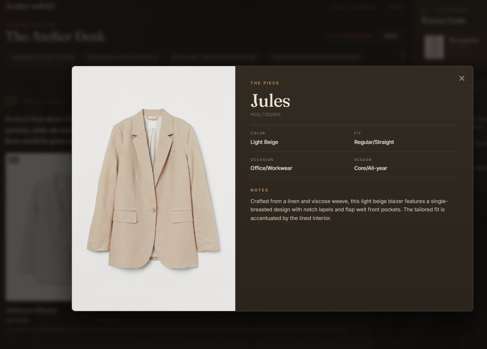
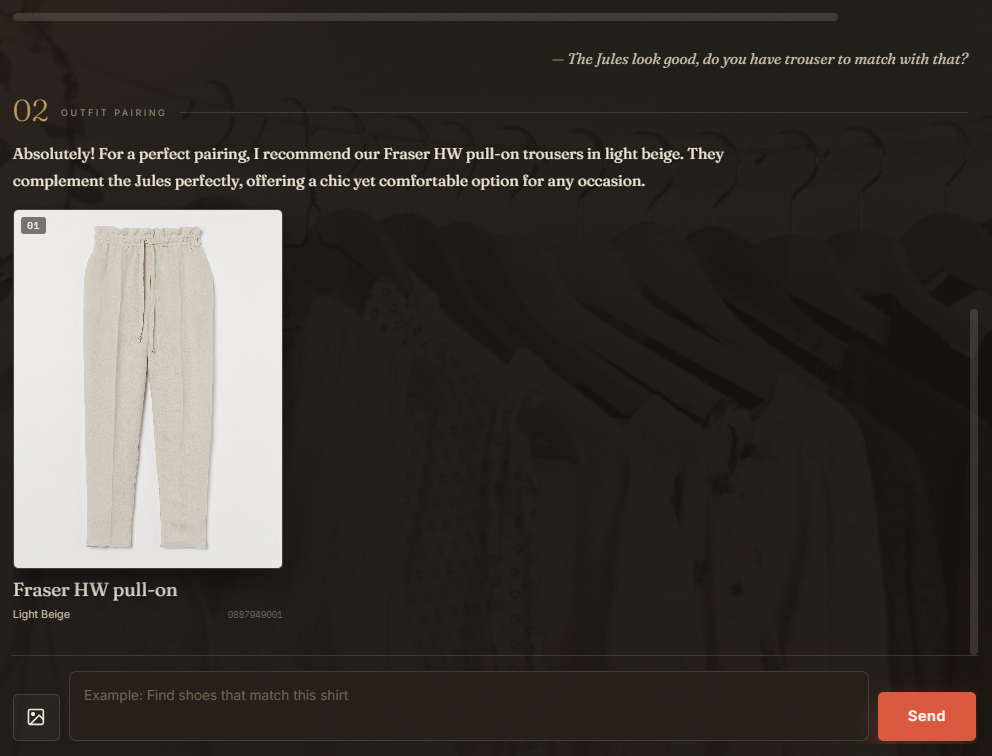
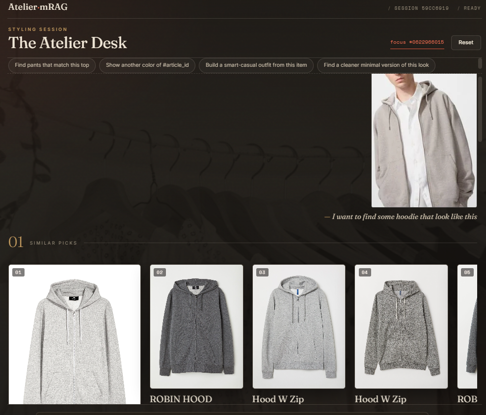
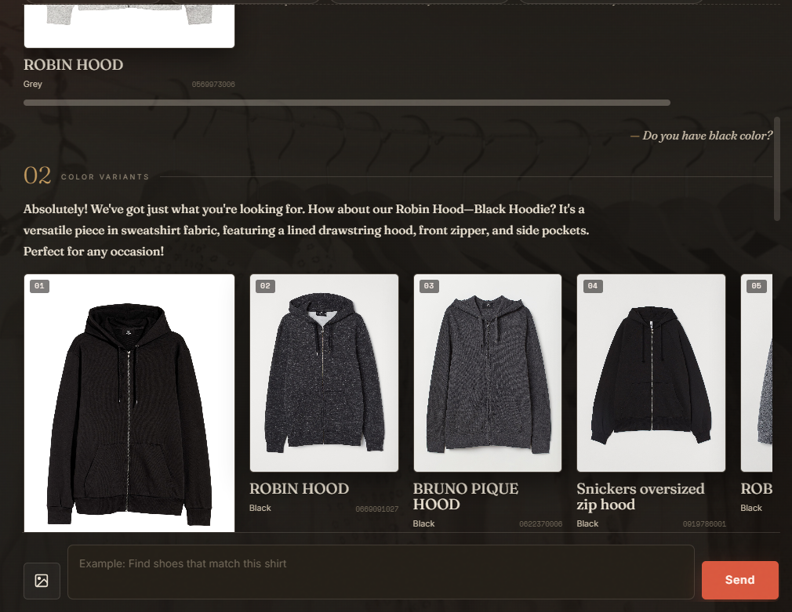
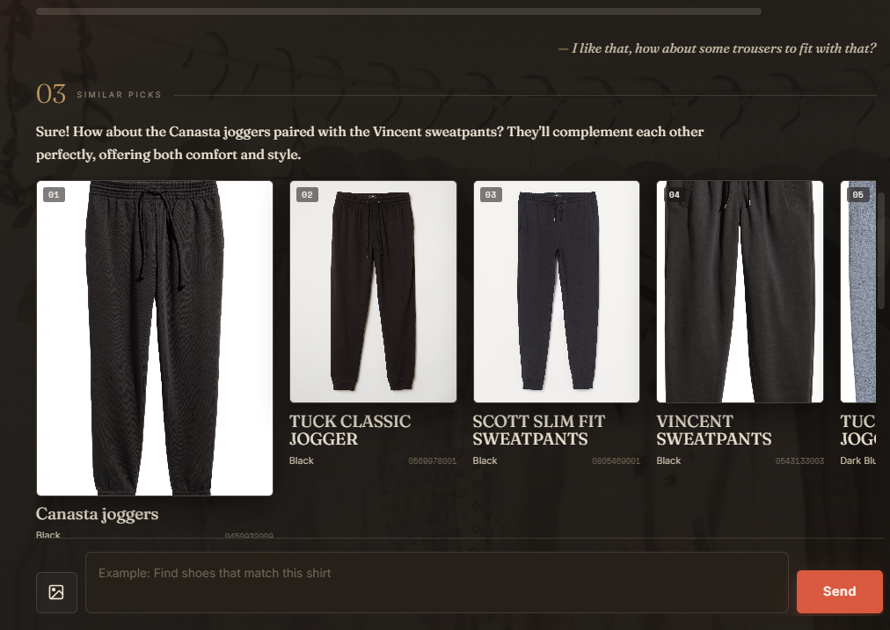
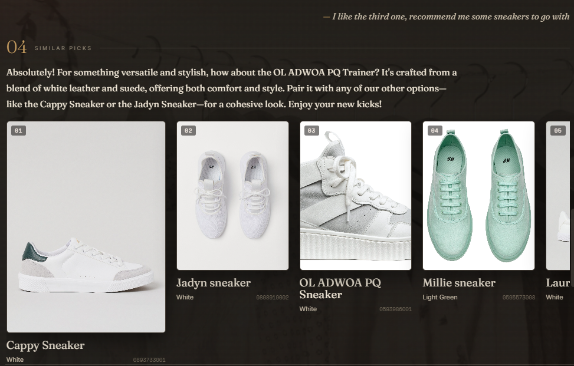
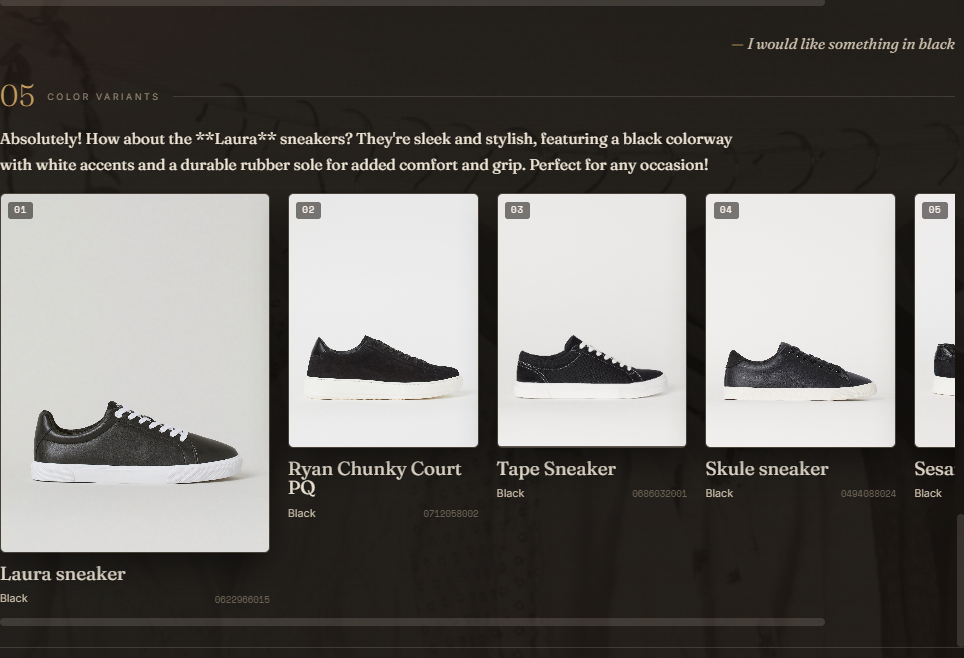

# mRAG — Multimodal Fashion Stylist

A multimodal retrieval-augmented fashion assistant over the H&M catalogue. It finds, pairs,
and re-colours outfits from natural-language **and** image queries, then replies like a stylist.

---

## Overview

~70,000 H&M items are enriched by a vision-language model and indexed for hybrid retrieval
(SigLIP text+image + TF-IDF, RRF fusion). On top of retrieval the system adds a **learned outfit
compatibility** space, **content-based personalization**, and a small **conversational generator**.
The project was built incrementally from a naive baseline toward production-grade components.

## Features

- **Search** by text or by uploaded image (visual similar-items via image-kNN).
- **Outfit pairing** from a learned compatibility embedding — works even for items absent from
  the co-buy graph (cold-start safe), filtered by garment slot.
- **Colour variants** — "do you have it in black?" finds the same style in a new colour.
- **Cross-turn memory** — follow-ups refer to the item you are currently viewing.
- **Personalized re-rank** — optional taste profile per customer.
- **Robust NLU** — fine-tuned intent classifier + constrained (schema-locked) slot extraction.

## Architecture

## Tech stack

| Module | Technology |
|---|---|
| Frontend | React 18 (Babel standalone), Tailwind, GSAP |
| API | FastAPI (SSE streaming) |
| Intent classifier | DeBERTa-v3 fine-tuned · 5 intents · macro-F1 0.99 |
| Query understanding | Qwen2.5-1.5B-Instruct + `lm-format-enforcer` (schema-locked JSON) |
| Embeddings | SigLIP `siglip-base-patch16-224` — text + image, 768d |
| Sparse retrieval | TF-IDF (vocab 15,412) |
| Vector store | Qdrant — named vectors, HNSW, RRF fusion |
| Outfit graph | co-buy + slot taxonomy · 28.7k nodes / 302k edges |
| Compatibility | MLP metric head on SigLIP (PyTorch, InfoNCE + slot hard-neg) → 128d `compat_emb` |
| Personalization | content-based taste-profile re-rank |
| Answer generation | Qwen2.5-1.5B-Instruct |
| Data enrichment | Qwen2.5-VL |

---

## Demo

### Test 1 — Search → inspect → pair (a beige blazer)

**1. Search.** Ask for a beige single-breasted blazer; the stylist returns matching blazers with a short note.

**2. Inspect.** Click a result (*Jules*) for the full product card — colour, fit, occasion, notes. Details live on the card, not stuffed into the chat text.

**3. Pair.** Ask to complete the look; learned pairing suggests light-beige *Fraser* pull-on trousers to match the Jules blazer.

### Test 2 — Image search → variant → full outfit (one continuous session)

A single conversation; each step reuses the item in focus (cross-turn memory).

**1. Search by image.** Upload a reference photo (a grey zip hoodie); image-kNN returns visually similar hoodies.

**2. Colour variant.** "Do you have it in black?" → the same style in black.

**3. Pair trousers.** "Trousers to match?" → joggers / sweatpants that complement the hoodie.

**4. Pair shoes.** "Sneakers to match?" → footwear added to the outfit.

**5. Refine.** "Something in black." → the sneakers are refined to black.

---

